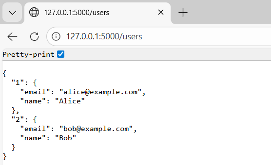
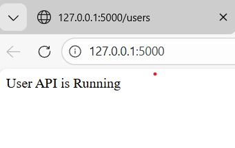

# Flask User API

This is a simple REST API built with **Flask** that manages user records in memory. It is intended as a college assignment demonstrating CRUD operations.

## 🔧 Prerequisites

- Python 3.7+ installed on your machine
- (Optional) [Postman](https://www.postman.com/) or `curl` for testing endpoints

## 🚀 Setup

1. Open a terminal and navigate to the project directory:
   ```powershell
   cd "c:\Users\Rahul B N\OneDrive\Desktop\Flask_User_API"
   ```
2. Create a virtual environment and activate it:
   ```powershell
   python -m venv .venv
   .venv\Scripts\Activate.ps1     # PowerShell
   ```
3. Install dependencies:
   ```powershell
   pip install flask
   pip freeze > requirements.txt    # optional
   ```

## ▶️ Running the Application

With the environment activated, start the server:

```powershell
set FLASK_APP=app.py
set FLASK_ENV=development    # enables debug/reload
flask run
```

The output should include:

```
* Serving Flask app 'app.py'
* Debug mode: on
* Running on http://127.0.0.1:5000/ (Press CTRL+C to quit)
```

You can also run `python -m flask run` instead.

## 📦 Available Endpoints

| Method | URL                    | Description                        |
|--------|------------------------|------------------------------------|
| GET    | `/users`               | List all users                     |
| GET    | `/users/<id>`          | Retrieve a single user by ID       |
| POST   | `/users`               | Create a new user                  |
| PUT    | `/users/<id>`          | Update an existing user            |
| DELETE | `/users/<id>`          | Remove a user                      |

### Sample Request Bodies

**POST /users**

```json
{
  "name": "Alice",
  "email": "alice@example.com"
}
```

**PUT /users/1**

```json
{
  "name": "Alice Smith",
  "email": "alice.smith@example.com"
}
```

## 🧪 Testing with Postman or Curl

Use the URLs above with the appropriate HTTP method. In Postman, set the body type to `raw` and choose `JSON` as the format.

Curl examples:

```bash
curl http://127.0.0.1:5000/users
curl -X POST http://127.0.0.1:5000/users -H "Content-Type: application/json" -d '{"name":"Bob","email":"bob@example.com"}'
curl -X PUT http://127.0.0.1:5000/users/1 -H "Content-Type: application/json" -d '{"name":"Bob Jones","email":"bob.jones@example.com"}'
curl -X DELETE http://127.0.0.1:5000/users/1
```

## ⚠️ Troubleshooting

- **Server doesn’t start:** Confirm the virtual environment is activated and Flask is installed (`pip list`).
- **Port conflict:** Use `flask run --port=5001` or another free port.
- **Syntax errors:** Run `python app.py` to see Python error messages.

## 🧾 Notes

- Data is stored in an in-memory dictionary and will reset when the server restarts.
- Feel free to extend the API with persistent storage, validation, authentication, etc.

---

Good luck with your assignment!

OUTPUT


